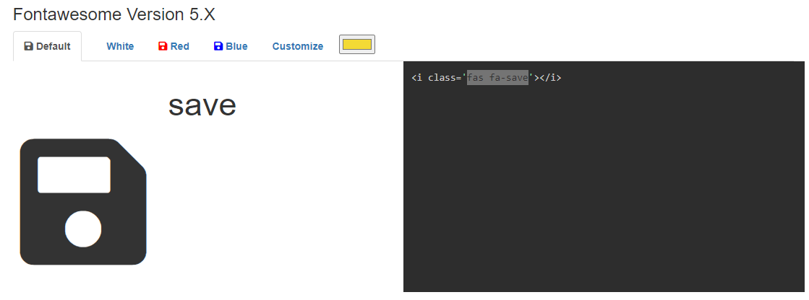

# WorkDayScheduler

## Description

The webpage provides a workday scheduler for current day. Simply enter any activities by hour from 9:00am-5:00pm and click the save icon. The text is then saved to local storage.

## Table of Contents

- HTML
- CSS
- Script
- Links

## HTML

The HTML file includes a jumbotron powered by bootstrap to incidate the title, description, and current date. Additionally, the container includes timeblocks from 9:00am-5:00pm. At the bottom of the HTML file are script links to jquery, moment.min.js for date, and script file described below. 

## CSS

The style sheet provides formatting for the webpage. For past hours, it colors the time block grey, present yellow, and future green. 

The "save" icon was pulled from fontawesome.com as shown in the below screenshot.

    ```md
    
    ```

## Script

Script file utilizes bootstrap capabilities. Also formats the date in the header to show day of the week, month, day, and year. Additionally lines 13-21 saves items in local storage per respective hour. For reference, "hour 13" is 1:00pm and so on. 

## Links

Published GitHub Page: https://deven1991.github.io/WorkDayScheduler/